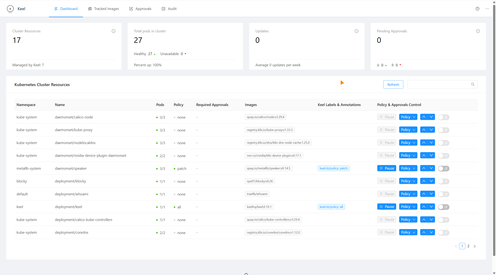

# Homelab Infrastructure

Kubernetes homelab with Flux Operator and Flux managing applications from Git.

## Architecture

- **Nodes**: `node1` (`10.0.0.21`), `node2` (`10.0.0.22`), `node3` (`10.0.0.23`)
- **Control plane**: `node1`
- **Workers**: `node2`, `node3`
- **Ingress**: Traefik
- **Storage**: Synology NFS (`10.0.0.11:/volume1/k8s`) through `nfs-k8s`
- **GitOps**: Flux Operator, Flux controllers, and native Flux resources
- **Git source**: the in-cluster Forgejo `homelab` repository

## Repository layout

```text
homelab/
├── docs/                    # Operations and recovery runbooks
├── kubernetes/              # Application charts and Flux resources
├── navidrome/               # Local utility scripts
└── scripts/                 # Repository validation scripts
```

## GitOps bootstrap

The one-time bootstrap uses Helm and kubectl. It installs Flux Operator, creates
the private Forgejo pull Secret outside Git, and applies the `FluxInstance`.

Follow [`docs/flux-gitops.md`](docs/flux-gitops.md). Do not push the removal of
Argo CD Applications until Flux has been installed and Argo reconciliation has
been stopped as described in that runbook.

## Service onboarding

1. Add or update the chart under `kubernetes/<service>/`.
2. Add the corresponding `HelmRelease` to
   `kubernetes/flux/cluster/apps/releases.yaml`.
3. Add external chart sources to `kubernetes/flux/cluster/sources.yaml` when
   required.
4. Add DNS and homepage entries when the service has a user-facing endpoint.
5. Add native OIDC clients to the Authentik Blueprint and store each client
   secret under its own `/oidc/<client>` Infisical path.
6. Run the repository validation commands from the Flux runbook.

## Documentation

- [`docs/flux-gitops.md`](docs/flux-gitops.md)
- [`docs/network-diagram.md`](docs/network-diagram.md)
- [`docs/kubernetes-storage.md`](docs/kubernetes-storage.md)
- [`docs/backup-procedures.md`](docs/backup-procedures.md)
- [`docs/disaster-recovery.md`](docs/disaster-recovery.md)


