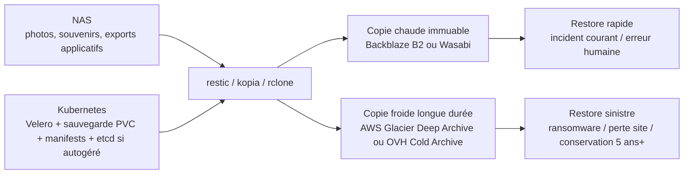
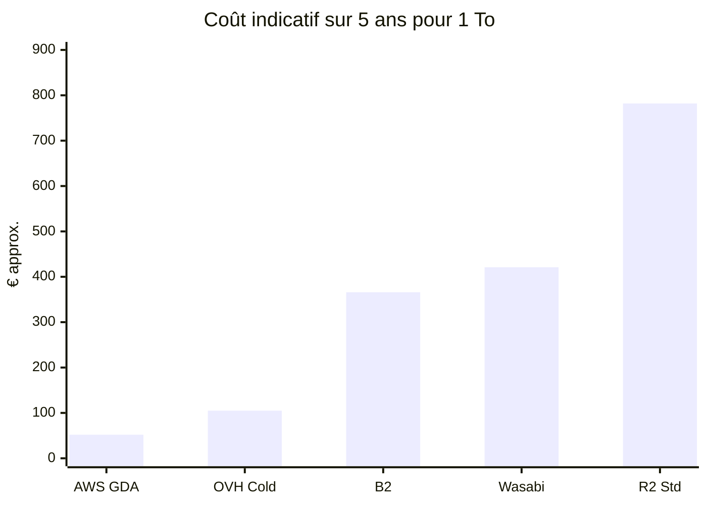

# Rapport de recherche approfondie sur les solutions de sauvegarde, cold storage et archivage pour un NAS avec applications Kubernetes et photos irremplaçables

## Synthèse exécutive

Pour un NAS qui contient à la fois des données “chaudes” de services Kubernetes et des données patrimoniales irremplaçables comme des photos et souvenirs, la meilleure réponse n’est généralement pas **une seule** cible de stockage, mais une **stratégie à deux vitesses** : une copie **en ligne, immédiatement restaurable et immuable** pour les incidents courants, et une copie **très froide et très économique** pour le sinistre majeur ou la conservation longue durée. Cette logique correspond aussi mieux aux contraintes de restauration des applications stateful Kubernetes : sauvegarde des volumes applicatifs, des manifests/secrets, et de l’éventuel `etcd` si le plan de contrôle est autogéré. citeturn22search5turn22search7turn22search8turn23search3

Au vu des tarifs publics, de la richesse documentaire officielle, des fonctions d’immutabilité et de la compatibilité outillage, les options les plus sérieuses aujourd’hui sont : **AWS S3 Glacier Deep Archive** pour le coût minimal de rétention longue, **OVHcloud Cold Archive** pour une option européenne/souveraine très orientée archivage sur bande, **Backblaze B2** pour une sauvegarde “hot” simple et moins chère que la plupart des clouds généralistes, **Wasabi Hot Cloud Storage** pour un modèle budgétaire très prévisible sans frais d’egress/API affichés, et **Cloudflare R2** quand le coût de sortie domine ou quand l’écosystème Cloudflare est déjà présent. citeturn24search6turn45search0turn12search0turn15search5turn40view0turn28search2turn27search11turn41search10

En classement pratique pour votre cas d’usage, le trio le plus pertinent est le suivant. **Meilleur couple coût/simplicité** : Backblaze B2 avec Object Lock pour la copie de sauvegarde “chaude”. **Meilleure conservation profonde** : AWS S3 Glacier Deep Archive si vous acceptez des restaurations en heures et une modélisation de coûts plus subtile. **Meilleure alternative européenne** : OVHcloud, idéalement en combinant Object Storage standard immuable pour les sauvegardes récentes et Cold Archive pour l’historique longue durée, car OVH précise que l’Object Lock n’est pas disponible sur la classe Cold Archive elle-même. citeturn43search1turn24search6turn45search1turn35search8turn35search0

La recommandation opérationnelle la plus robuste pour des souvenirs irremplaçables est donc : **une destination chaude immuable + une destination froide indépendante**, plutôt qu’un seul dépôt. En langage 3-2-1-1-0 : 3 copies, 2 supports/logiques différents, 1 hors site, 1 copie immuable, 0 erreur vérifiée par tests de restauration. Les outils modernes comme **restic**, **Kopia**, **rclone**, **Velero** et, selon les cibles SSH, **Borg**, permettent d’appliquer cette stratégie sans acheter une console de backup propriétaire. citeturn23search0turn23search1turn23search2turn23search3turn22search8turn17search1

Cette architecture est cohérente avec les capacités S3-compatible de Velero et de la plupart des outils de sauvegarde modernes, ainsi qu’avec les recommandations Kubernetes autour du backup de `etcd` et des snapshots de volumes de groupes. citeturn22search0turn22search5turn22search7turn22search12

## Hypothèses et méthode

Les hypothèses demandées ont été appliquées explicitement. La **rétention n’étant pas spécifiée**, j’ai modélisé des scénarios **1 an** et **5 ans**. La **bande passante n’étant pas spécifiée**, j’ai séparé les **coûts de stockage** des **coûts de restauration/egress** quand ceux-ci existent. J’ai supposé que vous savez utiliser des outils tels que `rsync`, `rclone`, `restic`, `aws s3`, `s3cmd`, `mc`, ainsi que les bases de Kubernetes et de Velero. Les montants ci-dessous sont **hors TVA**, calculés à partir des tarifs publics officiels disponibles le **27 juillet 2026**, et, lorsque nécessaire pour comparer visuellement, convertis en euro au **cours de référence BCE de 1 EUR = 1,1389 USD**. citeturn21search0turn21search1turn48view0turn40view0turn28search2turn27search11turn12search0

J’ai privilégié les **sources officielles** des fournisseurs et la documentation primaire. Là où un site expose mal ses tarifs en texte brut, je l’indique. Pour AWS S3 Glacier Deep Archive, par exemple, la page de pricing officielle renvoie vers le calculateur régional et expose surtout les règles de facturation, les durées minimales et les frais de restauration ; le chiffre de **0,00099 USD/Go-mois** reste cependant publié dans un billet officiel AWS consacré à Deep Archive. Il faut donc toujours revérifier la région cible dans le calculateur avant achat. citeturn48view0turn24search5turn45search1

Pour rester rigoureux, les **tables de coût** ci-dessous modélisent le **coût de stockage récurrent** seulement, sauf si le fournisseur inclut déjà l’egress ou les API dans le prix affiché. Les coûts peuvent donc augmenter en cas de restaurations fréquentes, de très grand nombre de petits objets, ou d’utilisation d’une classe archive nécessitant des frais de restauration. Ce point est particulièrement important pour **S3 Glacier Deep Archive**, qui ajoute **40 Ko de métadonnées facturées par objet archivé** et dont les restaurations créent une copie temporaire facturée en **S3 Standard** pendant la durée choisie. citeturn48view0turn24search6turn45search2turn45search14

Enfin, dans votre cas, il faut distinguer deux populations de données. Les **photos/souvenirs** supportent souvent un backup paquetisé, dédupliqué et chiffré, avec immutabilité forte. Les **apps Kubernetes** exigent en plus une séquence de backup/restauration cohérente : exports de bases, sauvegarde des manifests/secrets, sauvegarde des volumes persistants, et sauvegarde `etcd` si nécessaire. Un simple `rsync` d’un volume monté en écriture n’est pas toujours suffisant pour garantir une restauration applicative propre. citeturn22search5turn22search7turn22search15

## Comparatif transversal

Le tableau ci-dessous résume les options les plus pertinentes “aujourd’hui” pour votre besoin. Les lignes “froides” ont un coût au To très bas mais des restaurations plus lentes ; les lignes “hot/warm” sont bien plus simples à exploiter pour des restaurations fréquentes et des backends d’outils S3. Les citations sont intégrées par ligne, car les caractéristiques proviennent directement des documents fournisseurs. 

| Option | Type | Modèle tarifaire public | Gratuit / essai | Durée mini effective | Accès | Egress / retrieval | Immutabilité | Chiffrement / gestion des clés | Régions / résidence |
|---|---|---|---|---|---|---|---|---|---|
| **AWS S3 Glacier Deep Archive** citeturn48view0turn24search5turn45search0turn45search1turn32search1turn32search2 | Archive profonde | par Go-mois + requêtes/restauration | crédits AWS Free Tier, pas de palier gratuit dédié Deep Archive | 180 jours par objet | froid | frais de restauration + copie restaurée temporaire en S3 Standard | oui via S3 Object Lock | chiffrement par défaut, écosystème IAM/KMS AWS | nombreuses régions AWS, y compris UE |
| **OVHcloud Cold Archive** citeturn12search0turn15search5turn34search12turn35search8turn35search2 | Archive profonde sur bande | à partir de 0,002 USD/Go-mois + frais de restauration | 200 USD de crédits Public Cloud pour nouveaux clients | 180 jours d’après la page produit, usage prévu très long terme | froid | restauration payante, pas d’accès direct immédiat | **pas d’Object Lock sur la classe Cold Archive** | SSE-C, SSE-OMK, intégration KMS OVHcloud côté Object Storage | hébergement annoncé en France sur 4 DC séparés de >100 km |
| **Backblaze B2** citeturn40view0turn26search0turn26search1turn43search1turn43search0turn25search0 | Objet “always hot” | 6,95 USD/To/mois PAYG, ou réservations annuelles B2 Reserve | 10 Go toujours gratuits | aucune durée mini de stockage | chaud | egress gratuit jusqu’à 3× le stockage moyen mensuel, puis 0,01 USD/Go | oui, Object Lock + Legal Hold | SSE-B2 ou SSE-C | US East, US West, EU Central, Canada East |
| **Wasabi Hot Cloud Storage** citeturn28search2turn33search1turn33search5turn28search18turn46search1turn39view0turn46search7 | Objet “hot” | 7,99 USD/To/mois PAYG, ou Reserved Capacity 1/3/5 ans | essai 30 jours / 1 To | 90 jours PAYG, 30 jours RCS | chaud | pas de frais d’egress ou d’API affichés | oui, S3 Object Lock | chiffrement au repos, HTTPS, gestion Wasabi et options côté client | 16 régions globales, dont Amsterdam, Francfort, Paris |
| **Cloudflare R2 Standard** citeturn27search11turn27search3turn27search1turn41search0turn41search2turn41search13turn47search5 | Objet “hot/warm” | 0,015 USD/Go-mois + opérations, sans frais d’egress | 10 Go-mois + 1 M class A + 10 M class B | pas de mini sur Standard | chaud | pas de frais d’egress ; opérations facturées ; IA existe mais avec frais de retrieval | oui, bucket locks | chiffrement au repos/en transit ; SSE-C supporté ; pas d’Object Lock AWS natif via S3 API | placement automatique, location hints ou jurisdictions |

Deux remarques transversales sont essentielles. Premièrement, **AWS et OVH** sont de vraies réponses d’**archivage froid**, avec réhydratation/restauration préalable ; **Backblaze, Wasabi et R2 Standard** sont des réponses **chaudes**, immédiatement lisibles, donc plus adaptées comme backends quotidiens pour `restic`, `Kopia`, `Velero`, `rclone sync` ou des restaurations plus banales. Deuxièmement, la présence d’**immutabilité/WORM** change beaucoup la valeur d’une cible backup lorsqu’on craint l’erreur humaine, la suppression en chaîne ou un ransomware. citeturn45search2turn35search8turn43search1turn27search1turn35search0

Sur l’outillage, la situation est favorable. **rclone** sait piloter les fournisseurs S3 compatibles, y compris **OVHcloud**, **Hetzner**, **Wasabi**, **Cloudflare**, **AWS** et bien d’autres. **restic** fonctionne avec backends S3 compatibles et recommande même d’utiliser l’API S3-compatible pour Backblaze B2. **Kopia** supporte les stockages S3 compatibles, l’Object Lock et les classes hot/cold/archive lorsqu’elles existent côté fournisseur. **Borg**, lui, reste surtout pertinent pour des cibles **SSH/rsync** comme un Hetzner Storage Box ou un hôte de backup dédié. citeturn23search1turn23search0turn23search3turn17search1

Pour Kubernetes, le point important n’est pas “quel cloud” mais “quelle surface d’intégration”. **Velero** attend un `BackupStorageLocation` et sait travailler avec des object stores S3-compatibles. En pratique, cela rend **Backblaze B2**, **Wasabi**, **R2**, **OVH Object Storage** et **S3** tous utilisables comme dépôt de métadonnées de backup ou de contenu restaurable, sous réserve des plugins, certificats et particularités de signature/API du fournisseur. citeturn22search0turn22search8turn22search12turn22search14

## Modélisation des coûts

Le tableau suivant donne un **ordre de grandeur de coût de stockage** pour **1 To**, **5 To** et **20 To** sur **1 an** et **5 ans**. Il s’agit d’une modélisation **hors TVA**, **sans restauration**, **sans dépasser les gratuits/quotas d’API inclus**, et **hors coûts induits par un très grand nombre de petits objets**. Pour **Cloudflare R2**, le calcul tient compte des **10 Go-mois gratuits**. Pour **AWS Glacier Deep Archive**, le taux unitaire utilisé est le tarif officiel AWS couramment publié pour Deep Archive (**0,00099 USD/Go-mois**) ; il faut vérifier la région finale dans le pricing calculator avant engagement. citeturn24search5turn48view0turn12search0turn40view0turn28search2turn27search11turn21search1

| Option | Hypothèse de prix | 1 To / 1 an | 5 To / 1 an | 20 To / 1 an | 1 To / 5 ans | 5 To / 5 ans | 20 To / 5 ans |
|---|---:|---:|---:|---:|---:|---:|---:|
| AWS S3 Glacier Deep Archive | 0,99 USD/To/mois | 11,88 USD | 59,40 USD | 237,60 USD | 59,40 USD | 297,00 USD | 1 188,00 USD |
| OVHcloud Cold Archive | 2,00 USD/To/mois | 24,00 USD | 120,00 USD | 480,00 USD | 120,00 USD | 600,00 USD | 2 400,00 USD |
| Backblaze B2 | 6,95 USD/To/mois | 83,40 USD | 417,00 USD | 1 668,00 USD | 417,00 USD | 2 085,00 USD | 8 340,00 USD |
| Wasabi Hot Cloud Storage | 7,99 USD/To/mois | 95,88 USD | 479,40 USD | 1 917,60 USD | 479,40 USD | 2 397,00 USD | 9 588,00 USD |
| Cloudflare R2 Standard | 0,015 USD/Go-mois, 10 Go gratuits/mois | 178,20 USD | 898,20 USD | 3 598,20 USD | 891,00 USD | 4 491,00 USD | 17 991,00 USD |

Une lecture honnête de ces chiffres conduit à trois constats. **Sur la seule rétention**, AWS Deep Archive est dans une autre catégorie, suivi d’OVHcloud Cold Archive. **Backblaze B2** et **Wasabi** sont nettement plus chers au To, mais ils achètent de la simplicité opérationnelle, de l’accès immédiat et, surtout, un backend beaucoup plus naturel pour une restauration rapide. **Cloudflare R2 Standard** n’est pas compétitif pour un pur entrepôt de photos dormantes, mais il peut devenir rationnel quand les **sorties** sont importantes, puisque l’egress n’est pas facturé. citeturn24search5turn12search0turn40view0turn28search2turn27search11turn41search10

Ce graphique convertit simplement les montants USD en EUR avec le cours de référence BCE du 27 juillet 2026. Il ne modélise ni egress, ni restore, ni API payantes, ni surcoûts liés à de très nombreux petits objets. citeturn21search0turn21search1turn24search5turn12search0turn40view0turn28search2turn27search11

La vraie lecture économique doit donc intégrer la **fréquence de restauration**. Un stockage froid très bon marché devient vite moins intéressant si vous restaurez souvent. À l’inverse, une cible chaude plus chère par To peut revenir moins cher en coût total si elle évite des frais de réhydratation, des délais de 12 à 48 heures, des scripts de restore plus complexes, ou des erreurs pendant une reprise après incident. citeturn45search0turn45search2turn15search5turn27search11

## Analyse détaillée des options recommandées

### AWS S3 Glacier Deep Archive

AWS positionne **S3 Glacier Deep Archive** comme sa classe de stockage d’archive la moins chère, avec une durée minimale de stockage de **180 jours**, des restaurations **Standard en environ 12 heures** et **Bulk en environ 48 heures**, et une intégration native avec les mécanismes S3 comme **Lifecycle**, **Object Lock** et **Replication**. AWS rappelle aussi que les objets archivés dans Deep Archive portent **40 Ko de métadonnées supplémentaires par objet**, ce qui pénalise les jeux constitués de très nombreux petits fichiers. citeturn45search0turn45search1turn24search6turn48view0

**Ce que j’en pense pour votre usage.** C’est le meilleur choix si vous cherchez la **copie la moins chère possible à 5 ans** et que vous acceptez un vrai mode “archive”, pas un bucket de secours à ouvrir à tout moment. C’est très fort pour une copie mensuelle ou trimestrielle “dernier recours” de photos, exports d’applications, dumps et snapshots packagés en gros fichiers. C’est moins agréable pour un dépôt primaire `restic` si vous voulez restaurer souvent ou par petites touches. citeturn24search6turn45search0turn45search2

**Points forts.** Coût imbattable à long terme ; fonctionnalités S3 matures ; immutabilité WORM ; très bon écosystème d’automatisation. **Limites.** Restauration lente ; structure de coûts plus complexe ; attention aux petits objets et aux frais de restauration. **Meilleur fit.** Seconde copie “disaster recovery / mémoire familiale / conservation très longue”. citeturn24search6turn45search1turn48view0

**Procédure de restauration typique.** Vous initiez un `restore-object` en choisissant un niveau de restauration, AWS crée une **copie temporaire** lisible dans le bucket pour une durée donnée, puis vous téléchargez ou recopiez l’objet vers une classe chaude si vous voulez le conserver de façon permanente. Cette étape intermédiaire de réhydratation est ce qui distingue Glacier Deep Archive des stockages “hot”. citeturn45search2turn45search3

**Checklist d’implémentation.**
- Agréger les petits fichiers en archives plus grosses avant envoi, pour réduire l’effet des 40 Ko par objet.
- Utiliser `restic`/`Kopia` vers S3 si vous savez piloter la classe de stockage, sinon faire une transition Lifecycle après ingestion. 
- Activer Object Lock sur le bucket si la copie doit résister à la suppression/ransomware.
- Tester un restore complet au moins une fois par trimestre sur un échantillon réaliste. citeturn48view0turn24search6turn23search3

### OVHcloud Cold Archive

OVHcloud présente **Cold Archive** comme une solution d’archivage très économique opérant via **Object Storage + bandes magnétiques**, avec des données réparties dans **quatre datacenters en France séparés de plus de 100 km** et une durabilité annoncée à **11 neuf**. OVH indique qu’on peut récupérer des données en **quelques minutes à moins de deux heures pour moins de 1 To**, ou reconstruire des centaines de To en **48 heures** pour un restore de site complet. OVH documente aussi que la classe Cold Archive n’offre **pas** l’immutabilité Object Lock, qu’il faut donc obtenir en amont sur Object Storage standard si on veut cumuler WORM et froid profond. citeturn12search0turn15search5turn34search12turn35search8

**Ce que j’en pense pour votre usage.** C’est l’option la plus séduisante si vous valorisez une **résidence française/européenne** et une logique d’archivage proche de la bande managée, sans construire votre propre robot LTO. Son point faible est justement d’être un vrai service d’archive : ce n’est pas le meilleur backend de restauration quotidienne pour vos applications Kubernetes. En revanche, comme coffre-fort d’histoire familiale et de dumps packagés, c’est très cohérent. citeturn12search0turn15search5turn35search8

OVHcloud propose par ailleurs une documentation S3 moderne avec **rclone**, **s3cmd**, **lifecycle rules**, **réplication asynchrone**, **SSE-C** et **SSE-OMK**, ainsi qu’une intégration avec son propre **KMS** sur la partie Object Storage. Cela en fait une bonne plateforme pour un design “chaud puis froid” entièrement chez OVH : bucket S3 Object Storage immuable côté backup récent, transition Lifecycle vers classe froide pour l’historique. citeturn34search3turn34search6turn35search2turn35search5turn35search15

**Points forts.** Souveraineté/résidence FR fortes ; froid profond ; intégration rclone/S3 ; bon récit de conformité côté OVHcloud Public Cloud. **Limites.** Pas d’Object Lock directement sur Cold Archive ; logique de restore moins immédiate qu’un object store chaud. **Meilleur fit.** Archive patrimoniale européenne, second niveau d’une politique de backup. citeturn12search0turn35search8turn34search3turn34search6

**Procédure de restauration typique.** L’objet ou le bucket repasse temporairement au niveau Object Storage pour dépôt/récupération ; vous restaurez ensuite via outils S3/CLI habituels une fois l’archive “dégelée”. Cela ressemble davantage à un cycle “restauration d’archive” qu’à un simple `GET`. citeturn34search12turn15search5

**Checklist d’implémentation.**
- Créer un bucket Object Storage dédié aux sauvegardes ; activer Object Lock au départ si vous voulez du WORM.
- Utiliser Lifecycle pour pousser vers la classe Cold Archive seulement les points âgés.
- Chiffrer côté serveur via SSE-OMK ou SSE-C selon votre modèle de clés.
- Documenter une procédure de “dégel + rapatriement” avant le jour du sinistre. citeturn35search0turn35search2turn34search6

### Backblaze B2

Backblaze positionne **B2** comme un object storage **always hot**, **S3-compatible**, facturé **6,95 USD/To/mois**, sans **durée minimale de stockage**, avec **10 Go gratuits**, **egress gratuit jusqu’à 3× le stockage moyen mensuel**, puis **0,01 USD/Go**, et transactions API majoritairement gratuites. Les régions officielles sont **US East**, **US West**, **EU Central** et **Canada East**. Backblaze expose aussi **Object Lock**, **Legal Hold**, **Lifecycle Rules**, **SSE-B2** et **SSE-C**. citeturn40view0turn26search1turn43search1turn26search0turn26search7

**Ce que j’en pense pour votre usage.** C’est probablement l’option la plus facile à recommander comme **cible principale de sauvegarde distante** si vous cherchez un bon coût, une API simple et des restaurations sans réhydratation. Pour des photos irremplaçables, B2 devient particulièrement intéressant quand on active **Object Lock** et qu’on utilise `restic` ou `Kopia` avec dépôt chiffré client. Pour des workloads Kubernetes, B2 est aussi bien adapté comme backend de snapshots exportés et de contenu Velero, tant que vous gardez une procédure claire pour les bases de données et secrets. citeturn23search0turn23search3turn22search8turn43search1

Backblaze est aussi l’un des rares fournisseurs où la doc officielle parle très directement d’intégrations pratiques pour **rclone**, **WinSCP** et d’autres outils. La documentation `restic` recommande explicitement, pour B2, de privilégier l’**API S3-compatible** plutôt que le backend B2 natif à cause de questions de gestion d’erreurs de la bibliothèque B2. C’est un signal très fort en faveur d’un design standardisé S3 côté scripts. citeturn26search10turn25search3turn23search0

**Points forts.** Simplicité ; prix agressif pour du “hot” ; immutabilité solide ; peu de surprise si les restores restent modérés. **Limites.** Toujours plus cher qu’une archive profonde ; moins “souverain” qu’une option OVH/Hetzner si ce critère est central. **Meilleur fit.** Copie hors site primaire immédiatement restaurable. citeturn40view0turn43search1

**Procédure de restauration typique.** `restic restore`, `kopia restore` ou `rclone copy` depuis le bucket B2 vers une zone de staging, vérification d’intégrité, puis réinjection des données sur le NAS ou les volumes applicatifs. Pas de phase de réhydratation : l’objet est lisible directement. citeturn25search12turn26search10turn23search3

**Checklist d’implémentation.**
- Choisir **EU Central** si la latence/résidence européenne prime.
- Activer **Object Lock** + rétention par défaut.
- Utiliser des **app keys** restrictives par bucket/prefixe.
- Préférer le backend **S3-compatible** pour `restic`. citeturn26search1turn43search1turn43search6turn23search0

### Wasabi Hot Cloud Storage

Wasabi facture son stockage objet **7,99 USD/To/mois** en PAYG, affiche **pas de frais d’egress ni d’API**, propose un essai **30 jours / 1 To**, et un programme **Reserved Capacity Storage** sur **1, 3 ou 5 ans** à partir de **25 To**. En contrepartie, Wasabi rappelle qu’en PAYG la durée minimale de facturation est **90 jours** par objet, et **30 jours** en RCS. La société opère **16 régions** au total, dont **Amsterdam, Francfort et Paris** en Europe. citeturn28search2turn33search1turn33search5turn28search18turn28search0turn39view0turn46search7

Wasabi annonce **11 neuf de durabilité**, chiffrement au repos et en transit, **S3 Object Lock**, ainsi qu’un positionnement “toujours chaud” sans pénalité de réhydratation. Wasabi a aussi un argument spécifique intéressant pour un environnement NAS : **Wasabi Cloud NAS**, facturé séparément, ajoute une logique de passerelle/tiering on-prem et évite de devoir tout écrire soi-même si vous voulez un mode plus “appliance logicielle + objet cloud”. citeturn46search1turn46search7turn37search17turn37search4turn37search12

**Ce que j’en pense pour votre usage.** Wasabi devient très intéressant si vous privilégiez la **prévisibilité de facture** et si vous n’aimez pas les modèles “storage pas cher mais sortie chère”. Pour un NAS familial avec beaucoup de contenu média et la possibilité de restaurer un gros volume un jour de crise, cet argument a de la valeur. En revanche, si vous faites énormément de rotation/suppression avant 90 jours, la politique de durée minimale peut coûter plus cher qu’un Backblaze B2. citeturn33search3turn28search18turn40view0

**Points forts.** Facture lisible ; egress/API annoncés gratuits ; régions européennes dont Paris ; option Cloud NAS ; immutabilité. **Limites.** Plus cher que B2 en PAYG ; durée minimale 90 jours. **Meilleur fit.** Sauvegarde chaude de taille moyenne à grande, surtout si la restauration potentielle peut être massive. citeturn33search3turn28search18turn37search17turn46search7

**Procédure de restauration typique.** Identique à un S3 chaud classique : téléchargement ou restauration logique immédiate via `rclone`, `restic`, `Kopia`, ou un logiciel de backup tiers. Pas de réhydratation ; récupération directe. citeturn36search13turn23search3

**Checklist d’implémentation.**
- Vérifier si votre profil de données évite les suppressions <90 jours.
- Activer Object Lock/WORM sur les buckets critiques.
- Si vous voulez une passerelle on-prem, évaluer **Wasabi Cloud NAS** plutôt qu’un simple script `mount`.
- Si vous dépassez durablement 25 To, demander une offre **RCS**. citeturn28search18turn37search17turn28search0turn33search9

### Cloudflare R2

Cloudflare R2 est un object storage conçu pour éviter les **frais d’egress**, avec un modèle de prix composé de **stockage + opérations Class A / Class B**, et un **free tier** comprenant **10 Go-mois**, **1 million** d’opérations Class A et **10 millions** de Class B. La documentation R2 indique une compatibilité **S3 API**, des **bucket locks** pour imposer la rétention, un support **rclone**, et une politique de **data location** fondée sur placement automatique, location hints ou jurisdictions. Cloudflare documente également une **availability SLA de 99,9 %** pour R2 et un corpus de certifications incluant **ISO 27001**, **ISO 27018**, **ISO 27701**, **SOC 2 Type II**, **PCI DSS Level 1**, ainsi qu’une conformité GDPR documentée via le Trust Hub. citeturn27search11turn27search3turn27search1turn27search0turn41search0turn41search13turn47search5turn47search2

**Ce que j’en pense pour votre usage.** R2 n’est pas la meilleure réponse pour de l’archive patrimoniale “dormante” à très bas coût. En revanche, il devient excellent quand le risque financier principal n’est **pas le stockage**, mais la **sortie** ou la **distribution** de données : gros restores, syncs fréquents, ou trafic sortant non négligeable. Si vous utilisez déjà Workers, Tunnel, Access ou le CDN Cloudflare, l’intégration peut aussi compter. citeturn41search10turn27search2turn27search0

Cloudflare propose aussi une classe **Infrequent Access** moins chère au Go, mais avec des coûts de récupération et d’opérations plus élevés. Ce n’est pas un “cold archive” à la Glacier : on reste dans une logique de classe tarifaire d’object store, pas de réhydratation sur 12 à 48 heures. Pour une politique simple, je recommande R2 **Standard** si vous le retenez. citeturn27search5turn27search11turn27search13

**Points forts.** Egress nul ; bon free tier ; S3-compatible ; bucket locks ; résidence configurable par juridiction. **Limites.** Plus cher en stockage pur ; coûts d’opérations à surveiller ; moins pertinent qu’AWS/OVH pour de l’archive profonde. **Meilleur fit.** Sauvegarde/restauration où l’egress domine le TCO. citeturn27search11turn27search1turn41search13

**Procédure de restauration typique.** Téléchargement direct via API S3, `rclone`, `aws s3` ou intégration applicative. Sur R2 Standard, pas de réhydratation archive. Sur IA, il faut surtout intégrer le coût de récupération, pas un long délai de restauration. citeturn27search0turn27search2turn27search3turn27search11

**Checklist d’implémentation.**
- Prendre R2 **Standard** pour une politique simple et restaurable.
- Créer des **bucket locks** avant mise en production.
- Définir le **mode de localisation des données** si la résidence est importante.
- Surveiller les opérations Class A/B si vous utilisez beaucoup de petits fichiers. citeturn27search1turn41search13turn27search11

## Alternatives matérielles et options hors classement

Les solutions matérielles gardent un intérêt réel lorsqu’on veut un **air-gap physique**. La référence historique reste le **LTO**, aujourd’hui au moins en **LTO‑9**, avec **18 To natifs** par cartouche et **45 To compressés** annoncés, ainsi que des médias **WORM** disponibles chez HPE/IBM. IBM documente aussi des débits soutenus élevés pour LTO‑9. En pratique, le frein n’est pas la bande, mais le lecteur : les prix vus chez des revendeurs professionnels européens pour des lecteurs LTO‑9 externes ou internes se situent aujourd’hui grossièrement entre **5 000 € et 10 000 €**, tandis que les cartouches LTO‑9 se trouvent plutôt autour de **60–66 £** l’unité selon les références et vendeurs consultés. citeturn29search2turn29search1turn29search9turn30search1turn30search2turn29search11

Conclusion pratique : **le LTO‑9 n’est pas intéressant à 1 To ou 5 To** si vous devez acheter le matériel ex nihilo. À **20 To et au-delà**, surtout avec conservation 5 ans+, air-gap obligatoire et procédures disciplinées, cela redevient défendable. Son inconvénient est opérationnel : restauration séquentielle, logistique des médias, vérification régulière, et nécessité d’un process humain sérieux. Son avantage est très fort contre le ransomware et la corrélation de pannes cloud. citeturn29search2turn29search10turn29search9

L’autre voie matérielle est la **rotation de disques externes chiffrés hors ligne**. Ce n’est pas une “solution de service” au sens cloud, mais c’est souvent la manière la moins chère d’ajouter une **copie hors ligne** à un système familial. Western Digital documente des gammes de disques externes allant aujourd’hui jusqu’à **26 To** pour My Book. Cette voie est économiquement excellente si vous acceptez la manutention manuelle, la discipline de rotation, le chiffrement côté client, et surtout les **tests réguliers de restauration**. citeturn31search2turn31search5turn31search12

Enfin, une option “hors classement” mais intéressante parce qu’elle colle à votre mention de `rsync` est **Hetzner Storage Box**. Ce n’est pas un object store S3 froid, mais un stockage de backup très peu cher, avec **rsync via SSH**, **BorgBackup**, **Restic**, **Rclone**, **SFTP**, **Samba/WebDAV**, **trafic illimité**, **pas de durée minimale de contrat**, et des **snapshots**. En revanche, Hetzner indique que les données sont stockées sur **un seul hôte** avec RAID ; ce n’est donc pas la meilleure réponse comme **unique** coffre-fort de souvenirs irremplaçables. C’est plus un bon **deuxième dépôt de backup en ligne** qu’une archive de référence finale. citeturn44search0turn44search1turn17search1turn17search6turn44search3

## Recommandation finale et checklist de mise en œuvre

Si je devais recommander **une architecture unique** pour votre cas, je recommanderais : **Backblaze B2 ou Wasabi comme copie chaude immuable**, plus **AWS S3 Glacier Deep Archive ou OVHcloud Cold Archive comme copie froide longue durée**. Le choix entre **B2** et **Wasabi** dépend essentiellement de votre sensibilité à la facture de sortie : **B2** est légèrement moins cher en stockage et n’a pas de durée minimale ; **Wasabi** est plus simple à lire budgétairement et plus confortable si vous redoutez un gros restore. Le choix entre **AWS** et **OVH** dépend surtout de votre priorité entre **coût minimal absolu** et **ancrage européen/français**. citeturn40view0turn33search3turn24search5turn12search0

Si vous voulez **la solution la plus simple avec un seul fournisseur**, **Wasabi** est probablement le compromis le plus confortable, surtout si vous envisagez un jour une passerelle type **Cloud NAS**. Si vous voulez **le meilleur ratio coût / qualité de backend S3 chaud**, **Backblaze B2** est plus convaincant. Si votre priorité est **la conservation longue la moins chère**, prenez **AWS Deep Archive** mais **pas comme seule copie**. Si votre priorité est **résidence France / Europe** et documentation OVHcloud, prenez **OVH Object Storage immuable + transition vers Cold Archive**. citeturn37search17turn40view0turn24search6turn35search8

La checklist minimale que je vous conseille est la suivante. **Côté données NAS**, faites des sauvegardes **dédupliquées, chiffrées et versionnées** via `restic` ou `Kopia`. **Côté Kubernetes**, séparez les couches : `Velero` pour manifests et objets Kubernetes, snapshots/exports pour volumes persistants, dumps cohérents pour bases de données, et sauvegarde `etcd` si vous gérez vous-même le control plane. **Côté stockage**, activez systématiquement l’**immutabilité** quand elle existe, utilisez des **identifiants restrictifs** par bucket/prefixe, et testez des **restaurations réelles** plutôt que de supposer qu’un backup est bon. citeturn23search3turn22search8turn22search5turn43search1turn35search0turn27search1

Enfin, pour une première implémentation réaliste sans surcoût logiciel :
- **NAS / photos** : `restic` ou `Kopia` vers **B2** ou **Wasabi**, avec rétention immuable.
- **Kubernetes** : `Velero` vers le même object store, plus exports/dumps applicatifs pour les bases.
- **Archive profonde** : réplication périodique d’archives packagées vers **AWS Glacier Deep Archive** ou **OVH Cold Archive**.
- **Test de reprise** : restauration trimestrielle sur un répertoire de staging ou un nœud de test, contrôle checksums, puis simulation de remise en route d’une application. citeturn23search0turn23search3turn22search8turn24search6turn15search5

## Sources officielles principales

Les sources les plus utiles pour ce rapport sont : la **tarification et la documentation S3/AWS** pour Deep Archive, restaurations, durées minimales et conformité AWS citeturn48view0turn45search0turn45search1turn47search3turn47search12 ; la **documentation OVHcloud** pour Cold Archive, Object Storage, Object Lock, rclone, lifecycle, chiffrement et conformité citeturn12search0turn15search5turn34search3turn34search6turn35search0turn35search2 ; la **documentation Backblaze** pour B2 pricing, régions, chiffrement, Object Lock et conformité citeturn40view0turn26search0turn26search1turn43search1turn43search0 ; la **documentation Wasabi** pour pricing, durées minimales, essai gratuit, régions, durabilité et Wasabi Cloud NAS citeturn28search2turn33search1turn28search18turn39view0turn46search1turn37search17 ; la **documentation Cloudflare** pour R2 pricing, bucket locks, sécurité, localisation des données et conformité citeturn27search11turn27search1turn41search2turn41search13turn47search5 ; et la documentation primaire des outils **Velero**, **restic**, **Kopia**, **rclone** et **Borg** pour l’intégration outillage et Kubernetes citeturn22search8turn23search0turn23search1turn23search2turn23search3.