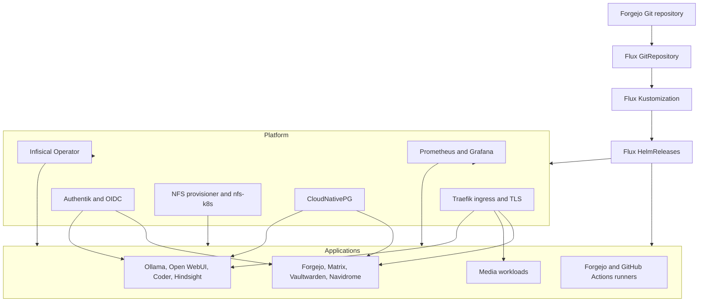

# Public architecture overview

This project runs a small Kubernetes platform on three nodes. Git is the
source of truth. Flux reads the repository, applies the cluster resources, and
reconciles Helm releases until the live state matches the declared state.

## System map

## Layers and responsibilities

### Git and reconciliation

`kubernetes/flux/bootstrap/` contains the one-time Flux Operator resources.
`kubernetes/flux/cluster/` contains the steady-state cluster definition:
namespaces, external chart sources, and HelmReleases.

The cluster Kustomization applies the resources in `apps/`. Each HelmRelease
points either to an external chart source or to a local chart in this
repository. `dependsOn` expresses ordering between platform, identity,
database, storage, and application releases.

### Platform services

- Traefik receives HTTP and TCP traffic and routes it to in-cluster Services.
- Authentik provides SSO through OIDC clients defined in its blueprints.
- Infisical supplies runtime credentials through Kubernetes custom resources.
- The NFS subdir provisioner creates PVC directories below the Synology export.
- CloudNativePG manages PostgreSQL clusters used by stateful services.
- Prometheus collects metrics and Grafana presents dashboards.

### Applications and developer services

Local charts describe project-specific resources for self-hosted services, the
media stack, AI services, Coder workspaces, and CI runners. External charts are
configured through generated ConfigMaps in
`kubernetes/flux/cluster/apps/kustomization.yaml`.

`kubernetes/active-local-charts.txt` is the validation boundary. A chart listed
there is linted, rendered, and checked with kubeconform in CI.

## Persistent data and failure boundaries

Standard PVCs use the shared `nfs-k8s` StorageClass. Application data therefore
does not depend on the disk of `node2` or `node3`, and a workload can move to
the other worker during maintenance or a worker failure.

The design still has clear limits:

- `node1` is the only control-plane node.
- Synology NFS is a central storage dependency.
- Some PostgreSQL clusters and applications intentionally run one replica.
- Hardware-specific workloads may not be schedulable on every node.

These are accepted homelab trade-offs. Backup, node draining, storage
migration, and disaster recovery procedures are documented in `docs/`.

## Security and publication

Runtime credentials stay outside Git. Public copies must remove private
hostnames, addresses, identities, registry endpoints, deploy keys, kubeconfigs,
and access instructions. See [`publication.md`](publication.md) before
publishing a repository mirror.
