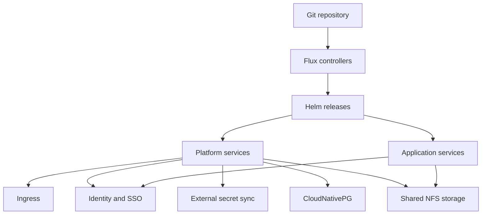

# Public architecture overview

This project runs a small Kubernetes platform on three nodes. Flux reads the
desired state from Git and reconciles the cluster through Helm releases and
Kustomize resources.

## Main responsibilities

### GitOps

Flux owns reconciliation. A change is reviewed in Git, validated in CI, merged,
and then applied by Flux. Drift detection keeps live Helm releases aligned with
the repository.

### Secrets

Runtime credentials do not belong in Git. Infisical stores secrets and the
Infisical operator creates the Kubernetes Secrets consumed by workloads.

### Persistent data

Standard PVCs use a shared NFS-backed StorageClass. This avoids tying data to a
worker-local disk and allows workloads to move between workers during planned
maintenance or a node failure.

### Reliability

The repository contains backup, restore, node-drain, storage, and incident
runbooks. The platform still has deliberate homelab limitations, including one
control plane and one central storage backend.

## Public configuration rule

The operational repository contains environment-specific values. A public copy
must replace private hostnames, addresses, identities, registry endpoints, and
access instructions with examples before publication.
