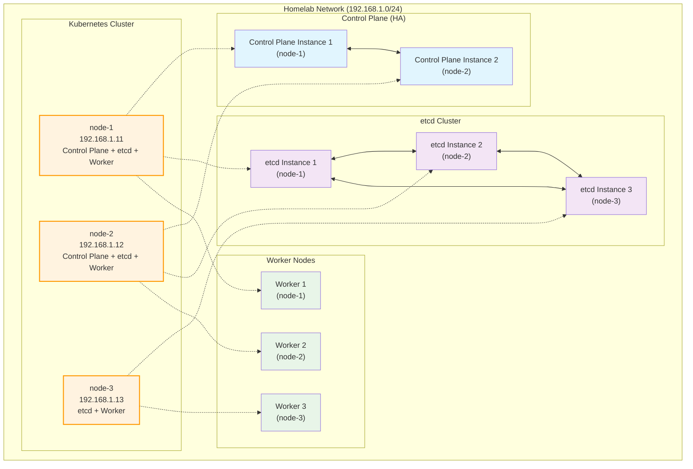

# Homelab Network Diagram

## Overview
This document describes the network topology and infrastructure of the homelab environment.

## Network Configuration

### Node Details
| Node | IP Address | Roles | User | OS |
|------|------------|-------|------|----|
| node-1 | 192.168.1.11 | Control Plane, etcd, Worker | tmendy | Ubuntu Server |
| node-2 | 192.168.1.12 | Control Plane, etcd, Worker | tmendy | Ubuntu Server |
| node-3 | 192.168.1.13 | etcd, Worker | tmendy | Ubuntu Server |

## Network Topology

## Infrastructure Details

### Kubernetes Cluster Architecture
- **High Availability Control Plane**: 2 control plane nodes (node-1, node-2)
- **etcd Cluster**: 3-node etcd cluster for high availability
- **Worker Nodes**: All 3 nodes serve as worker nodes

### Network Specifications
- **Network Range**: 192.168.1.0/24
- **SSH User**: tmendy (with sudo privileges)
- **Management**: Ansible-managed infrastructure

### Node Functions

#### node-1 (192.168.1.11)
- Kubernetes Control Plane
- etcd cluster member
- Worker node

#### node-2 (192.168.1.12)
- Kubernetes Control Plane (HA pair with node-1)
- etcd cluster member
- Worker node

#### node-3 (192.168.1.13)
- etcd cluster member
- Worker node only

## Ansible Management
All nodes are managed through Ansible with the following groups:
- `kube_control_plane`: node-1, node-2
- `etcd`: node-1, node-2, node-3
- `kube_node`: node-1, node-2, node-3
- `k8s_cluster`: All nodes in the cluster
