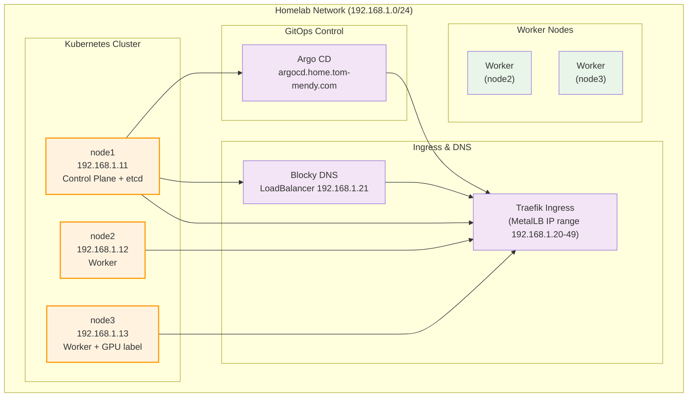

# Homelab Network Diagram

## Overview

This document describes the network topology and infrastructure of the homelab environment.

## Network Configuration

### Node Details

| Node | IP Address | Roles | User | OS |
|------|------------|-------|------|----|
| node1 | 192.168.1.11 | Control Plane, etcd | tmendy | Ubuntu Server |
| node2 | 192.168.1.12 | Worker | tmendy | Ubuntu Server |
| node3 | 192.168.1.13 | Worker (GPU label) | tmendy | Ubuntu Server |

## Network Topology

## Infrastructure Details

### Kubernetes Cluster Architecture

- **Control Plane**: single node (`node1`)
- **etcd**: collocated with control-plane node
- **Worker Nodes**: `node2`, `node3`

### Network Specifications

- **Network Range**: 192.168.1.0/24
- **SSH User**: tmendy (with sudo privileges)
- **Management**: Ansible-managed infrastructure

### Node Functions

#### node1 (192.168.1.11)

- Kubernetes Control Plane
- etcd member

#### node2 (192.168.1.12)

- Worker node

#### node3 (192.168.1.13)

- Worker node
- Labeled `gpu=true` by Ansible prerequisites

## Ansible Management

All nodes are managed through Ansible with the following groups:

- `kube_control_plane`: `node1`
- `etcd`: `node1`
- `kube_node`: `node2`, `node3`
