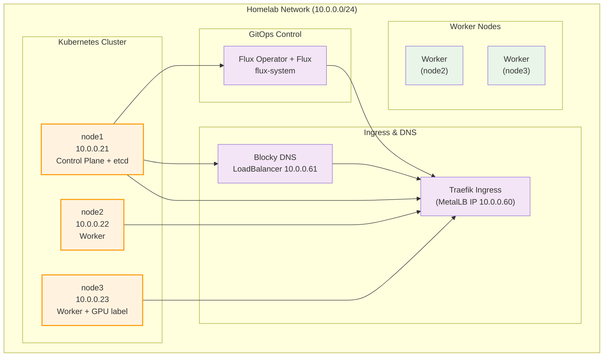

# Homelab Network Diagram

## Overview

This document describes the network topology and infrastructure of the homelab environment.

## Network Configuration

### Node Details

| Node | IP Address | Roles | User | OS |
|------|------------|-------|------|----|
| node1 | 10.0.0.21 | Control Plane, etcd | tmendy | Ubuntu Server |
| node2 | 10.0.0.22 | Worker | tmendy | Ubuntu Server |
| node3 | 10.0.0.23 | Worker (GPU label) | tmendy | Ubuntu Server |

## Network Topology

## Infrastructure Details

### Kubernetes Cluster Architecture

- **Control Plane**: single node (`node1`)
- **etcd**: collocated with control-plane node
- **Worker Nodes**: `node2`, `node3`

### Network Specifications

- **Network Range**: 10.0.0.0/24
- **LoadBalancer Range**: 10.0.0.60-10.0.0.89
- **SSH User**: tmendy (with sudo privileges)
- **Management**: Kubernetes plus Flux GitOps

### Node Functions

#### node1 (10.0.0.21)

- Kubernetes Control Plane
- etcd member

#### node2 (10.0.0.22)

- Worker node

#### node3 (10.0.0.23)

- Worker node
- Labeled `gpu=true` for GPU workloads

## GitOps Management

Flux Operator and the Flux controllers run in `flux-system`. They reconcile the
application charts from the in-cluster Forgejo repository.
